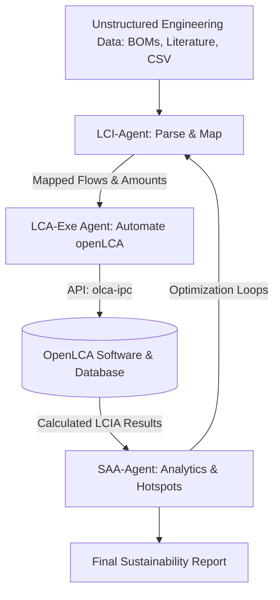

# NSF Proposal: Project Description

**Project Title:** Agentic AI for Autonomous Life Cycle Assessment and Sustainability Analytics  
**Target Program:** Engineering Environmental Resiliency (EER)  

---

## 1. Introduction and Vision
Quantifying the environmental footprint of human activities is fundamental to safeguarding environmental health and building a circular economy. Life Cycle Assessment (LCA) is the standard methodology used by researchers, industries, and policymakers to evaluate these footprints. However, the current practice of LCA is highly bottlenecked:
- **High Resource Requirements:** Manual compilation of Life Cycle Inventory (LCI) data from Bills of Materials (BOMs), chemical syntheses, and utility bills can take months of expert labor.
- **Cognitive Load in Database Mapping:** Mapping unstructured, real-world data to specific, structured flows inside environmental databases (e.g., ecoinvent) is prone to mapping errors and subjective bias.
- **Static Decision Making:** Once built, LCA models are rarely updated dynamically, rendering them ineffective during active, fast-paced product design phases.

The vision of this project is to develop **Agentic LCA**, an autonomous, open-source, multi-agent AI system that serves as an intelligent co-pilot for environmental engineering. The proposed framework programmatically orchestrates the lifecycle assessment process by interfacing with the open-source **OpenLCA** software. By translating high-level human objectives (e.g., "Minimize the global warming potential of this solar cell manufacturing facility while preserving resource efficiency") into executable Python routines via the OpenLCA IPC API (`olca-ipc`), the AI agent will perform autonomous model construction, validation, sensitivity analysis, and process design.

---

## 2. Technical Architecture & Multi-Agent Framework
The Agentic LCA framework consists of three specialized AI agents collaborating via a centralized consensus protocol:

### 2.1 The LCI-Agent (Inventory & Semantic Mapping)
The LCI-Agent ingests heterogeneous documents (academic papers, corporate invoices, lab notebook exports) and extracts material and energy inputs and outputs. It addresses the mapping problem—linking a user-defined input (e.g., "purified silicon") to the correct database flow (e.g., "Silicon, solar grade, at plant - ecoinvent")—using a hybrid neuro-symbolic approach. It combines LLM semantic embeddings with standard environmental ontologies (e.g., Bontology, ILCD) to calculate semantic similarity and maintain physical conservation constraints (mass/energy balances).

### 2.2 The LCA-Exe Agent (Execution & Database Automation)
The LCA-Exe Agent interacts programmatically with the **OpenLCA** instance using the `olca-ipc` Python library. It automates:
1. **Flow and Process Generation:** Creating new flows and unit processes in the database.
2. **Product System Linking:** Linking upstream and downstream process flows to compile a complete product system.
3. **LCIA Calculations:** Calling calculations using specified methods (e.g., ReCiPe 2016, IPCC GWP 100a) and retrieving impact indicator scores.

### 2.3 The SAA-Agent (Sustainability Analytics & Optimization)
The SAA-Agent acts as the decision-support system. It performs:
- **Hotspot Identification:** Analyzing contributing processes and identifying components responsible for the highest environmental impacts (e.g., electricity grid carbon-intensity in upstream material processing).
- **Uncertainty & Sensitivity Analysis:** Executing Monte Carlo simulations to assess parameter uncertainty.
- **Circular Economy Optimization:** Utilizing multi-objective genetic algorithms to suggest alternative supply paths and circular closed-loop recyclability pathways (minimizing carbon, water, and toxic emissions).

---

## 3. Research Objectives and Work Plan
The project will be executed over a 3-year period across three core research tasks:

### Task 1: Neuro-Symbolic Mapping of LCI (Months 1–12)
- **Objective:** Develop a robust, verifiable semantic matching engine to align engineering inventories with the ecoinvent database.
- **Methods:** Construct a vectorized database of ecoinvent process and flow descriptors. Fine-tune embedding models on chemistry and environmental engineering literature. Implement verification filters that check stoichiometry and material balance conservation.

### Task 2: OpenLCA API Automation & Orchestration (Months 13–24)
- **Objective:** Build the LCA-Exe software layer that translates LCI-Agent outputs into openLCA structures.
- **Methods:** Develop an open-source Python compiler that processes LCI schema graphs and generates OpenLCA-compatible JSON-LD files. Optimize port communication via `olca-ipc` for large-scale databases.

### Task 3: Sustainability Analytics & Trade-off Optimization (Months 25–36)
- **Objective:** Establish the optimization engine that queries OpenLCA iteratively to minimize environmental footprints.
- **Methods:** Implement multi-objective Pareto optimization loops. Test the framework on real-world case studies: (1) Solar-grade silicon production, and (2) Critical mineral recovery from electronic waste.

---

## 4. Intellectual Merit
This project advances the fundamental science of environmental informatics:
1. **Pioneering Neuro-Symbolic LCA:** Merging neural language representations with physical engineering conservation rules to eliminate the risk of hallucination in AI models.
2. **Dynamic LCA Paradigms:** Shifting lifecycle assessments from static, retrospective reports to dynamic, prospective design tools.
3. **Formalizing Circular Loop Optimization:** Defining mathematical frameworks for evaluating the net-benefit of circular recovery routes under high database uncertainty.

---

## 5. Broader Impacts
1. **Democratization of LCA:** Lowering the barrier to entry for life cycle design, helping SMEs and academic labs evaluate sustainability at early stages.
2. **Educational Outreach:** Creating the "Interactive Agentic LCA" dashboard for university curricula, enabling students to explore environmental design principles interactively.
3. **Open-Source Contribution:** Releasing all agent code, ontology maps, and OpenLCA Python scripts publicly on GitHub to support the global environmental engineering community.
