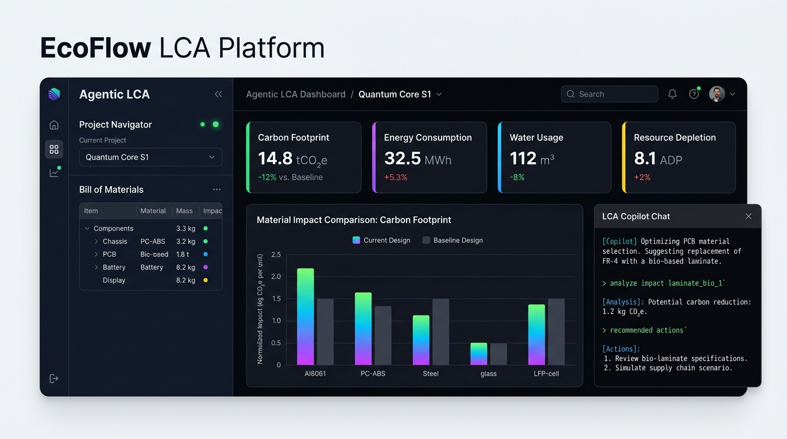
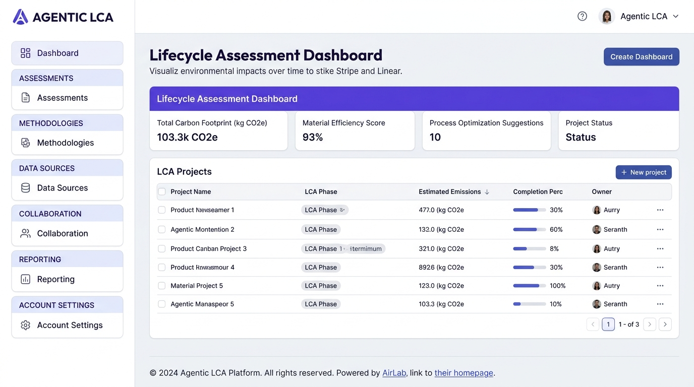

# 🌟 Agentic LCA: Autonomous Multi-Agent AI for Lifecycle Assessment

Welcome to **Agentic LCA**, a next-generation scientific AI copilot designed to automate, verify, and optimize Life Cycle Assessments (LCA). 

This platform connects directly to **OpenLCA 2.x** and uses **local offline Large Language Models (LLMs)** (via Ollama) to ingest raw Bills of Materials (BOM), verify thermodynamic mass conservation, dynamically identify environmental hotspots, search circular feedstock substitutes, and evaluate multi-objective Pareto trade-offs.

## 🖥️ Web Dashboard Showcase

Agentic LCA features a custom, premium web dashboard supporting dynamic Bill of Materials editing, real-time Pareto visualizations, and terminal copilot chat reasoning:

| Space Theme (Dark Mode) | Normal Theme (Light Mode) |
| :---: | :---: |
|  |  |

---

## 🚀 Key Features

* **🧠 Offline LLM Agentic Copilot**: Talk directly to your LCA model in real-time. Ask questions, get explanations, or command it to run swaps (e.g., *"replace steel with scrap steel"*).
* **📊 Multi-Objective Pareto Optimization**: Evaluates trade-offs across **Climate Change (GWP)**, **Terrestrial Acidification**, **Water Consumption**, and **Financial Material Costs** simultaneously.
* **⚖️ Thermodynamic Verification Layer (TVL)**: Ensures physical realism using stoichiometric and bulk mass conservation checks. It prevents the AI from proposing physically impossible substitutions.
* **🔍 Offline LCI Flow Mapper**: Custom TF-IDF search engine indexes all 65,000+ database flows to map unstructured BOM inputs to structured ecoinvent flows in milliseconds.
* **📦 Apptainer Containerization**: Zero-dependency deployment via a single Singularity Image Format (`.sif`) container file for High-Performance Computing (HPC) and research environments.

---

## 🛠️ Step-by-Step Installation Guide

Follow these steps to set up **Agentic LCA** on your local machine:

### 1. Clone & Install as a Single Python Library (Recommended)
Register the library globally so you can use the unified `lca-copilot` command line tool directly:
```bash
git clone https://github.com/shreesomnath/ai_agentic_opencla.git
cd ai_agentic_opencla
pip install -e .
```
*(Alternatively, you can just install the requirements using `pip install -r requirements.txt` and run the scripts directly.)*

### 2. Configure OpenLCA 2.x
1. Launch **OpenLCA 2.x** and activate your target database (e.g., `ecoinvent` or custom databases).
2. Start the background **IPC Server**:
   * Navigate to `Window` -> `Developer Tools` -> `IPC Server`.
   * Set the port to `8080`.
   * Click **Start** (verify the status is "Running").

### 3. Configure Your LLM Backend (Choose One)
You have two options to enable the LLM copilot chat:

* **Option A: Cloud API (Easiest - Zero Installation) 🌟**
  Simply export your Gemini, OpenAI, or Anthropic (Claude) API Key. The library uses direct HTTP calls with zero extra python dependencies:
  ```bash
  export GEMINI_API_KEY="your-gemini-api-key"
  # OR
  export OPENAI_API_KEY="your-openai-api-key"
  # OR
  export ANTHROPIC_API_KEY="your-anthropic-api-key"
  ```
* **Option B: Offline/Local LLM (Ollama)**
  You can let the CLI handle downloading, installing, starting Ollama, and pulling the recommended model:
  ```bash
  lca-copilot --install-ollama
  ```
  *(Alternatively, you can manually download and run **Ollama** from [ollama.com](https://ollama.com) and run `ollama pull qwen2.5-coder:7b` in your terminal.)*

---

## 💻 Running the Tool

Once installed as a library, you can run all components using the single `lca-copilot` command:

### Mode A: Standard Ingestion & Pareto Optimization
Runs bulk BOM Ingestion, TVL mass checks, sensitivity scans, feedstock optimization, and outputs a trade-offs chart:
```bash
lca-copilot
```

### Mode B: Interactive CLI Copilot (Command-Line Chat)
Enters an interactive terminal chat session to ask questions or run feedstock substitutions dynamically:
```bash
lca-copilot --chat
```

### Mode C: Graphical Web Dashboard (Easiest & Most Visual)
Launches the premium, theme-toggleable web dashboard with dynamic BOM table editing and visual chat copilot support:
```bash
lca-copilot --web
```
After starting the server, open your web browser and navigate to: **`http://127.0.0.1:5000/`**

---

## 📋 Selecting Sample BOMs
We have bundled pre-configured case studies representing key clean technologies in the `samples/` directory:

| Technology Case Study | Direct CLI Command |
| :--- | :--- |
| **Silicon Solar Cell (Default)** | `lca-copilot` |
| **Perovskite Tandem Solar Cell** | `lca-copilot --bom samples/perovskite_tandem_cell.csv --chat` |
| **Wind Turbine Blade** | `lca-copilot --bom samples/wind_turbine_blade.csv --chat` |
| **Lithium-Ion Battery Pack** | `lca-copilot --bom samples/lithium_ion_battery.csv --chat` |

---

## 🧭 Interactive Web Dashboard Guide

When running in **Web Dashboard Mode (`lca-copilot --web`)**, here is how to use the dashboard:
1. **Load a Case Study**: In the left column under "Case Study Select", choose one of the preloaded technologies (e.g. Silicon Solar Cell) and click "Load Case Study".
2. **Review Feedstock & Mappings**:
   - **Flat List**: Shows the flat bill of materials, ecoinvent mapped flows, mapping scores, unit, and prices.
   - **Hierarchical JSON**: Shows/compiles a multi-level product system.
   - **Autonomous Loop**: Auto-maps and runs optimization constraints programmatically.
3. **Verify Thermodynamic Mass Balance**: The TVL indicators (e.g. mass conservation badge, elemental balance status) confirm if the raw inputs match output expectations.
4. **Tune Scaling & Multi-Criteria Weights**:
   - Adjust the **Process scaling** input.
   - Set **TOPSIS weights** for Climate Change (GWP), Acidification, Water Consumption, and Cost to prioritize specific sustainability criteria.
5. **Interactive Copilot Chat**:
   - Type queries in the chat box on the right (e.g., *"Why does recycling glass cullet have less water impact?"*).
   - Instruct the copilot to run feedstock substitutions dynamically: *"replace glass fibre with glass cullet"* or *"what if we use recycled plastic?"*. The chart and engineering justification report will update automatically in real-time!

---

## 🐳 Reproducibility with Apptainer (Singularity)

For multi-user clusters or zero-install deployments, you can compile and run the system inside an Apptainer container:

```bash
# 1. Build the single SIF container image
apptainer build lca_copilot.sif Apptainer.def

# 2. Run the default optimization pipeline (uses host network to talk to openLCA)
apptainer run --network host lca_copilot.sif

# 3. Launch in interactive chat mode
apptainer run --network host lca_copilot.sif --chat
```

---

## 🎓 Academic Feasibility & Proposal
This software bridge serves as the experimental validation for the NSF CBET Engineering Environmental Resiliency (EER) proposal.
* **LaTeX Source**: [`NSF_Proposal.tex`](NSF_Proposal.tex)
* **Compiled Proposal Document**: [`NSF_Proposal.pdf`](NSF_Proposal.pdf)

---

## 🔬 Advanced Research Components (Year 1 & 2 Milestones)

We have successfully developed and validated the core scientific tasks outlined in the 3-Year NSF Proposal:

### 1. Stochastic Uncertainty Propagator (Task 1: Year 1)
* **Monte Carlo Engine (`UncertaintyPropagator`):** Calculates standard deviations for all BOM feedstocks based on AI mapping confidence: $\sigma_i = \text{amount} \times (1.0 - \text{mapping\_score}) \times 0.15$. It samples feedstock volumes from a normal distribution ($\ge 0$) and calculates 95% confidence interval bounds using dynamic linear sensitivities (first-order gradients) computed in openLCA.
* **Stoichiometric Elemental Conservation (TVL):** Extended the Thermodynamic Verification Layer in [agentic_lca/tvl.py](file:///Users/somnath.luitel/documents/airlab/openlca/agentic_lca/tvl.py) to parse molecular formulas (local dictionaries + PubChem REST API fallbacks) and check element conservation (carbon, silicon, hydrogen, oxygen, metals). Rejects substitutions with chemical mismatches $>20\%$ (e.g. plastic for steel).
* **Test Scripts:**
  - Run `python3 test_uncertainty.py` to verify Monte Carlo error propagation.
  - Run `python3 test_tvl_elemental.py` to inspect detailed element balances.
  - Run `python3 test_tvl_substitution.py` to check stoichiometric substitution filtering.

### 2. Hierarchical BOM Compiler (Task 2: Year 2)
* **Programmatic Supply-Chain Orchestration (`LcaCompiler`):** Recursively processes multi-level nested BOM trees in [agentic_lca/compiler.py](file:///Users/somnath.luitel/documents/airlab/openlca/agentic_lca/compiler.py). It dynamically registers custom product flows and unit processes in the database for intermediate sub-assemblies, links them, compiles a complete openLCA product system, and evaluates lifecycle footprints.
* **Test Script:**
  - Run `python3 test_compiler.py` to compile, verify mass-balance, and run calculations for a multi-level composite wind blade.
